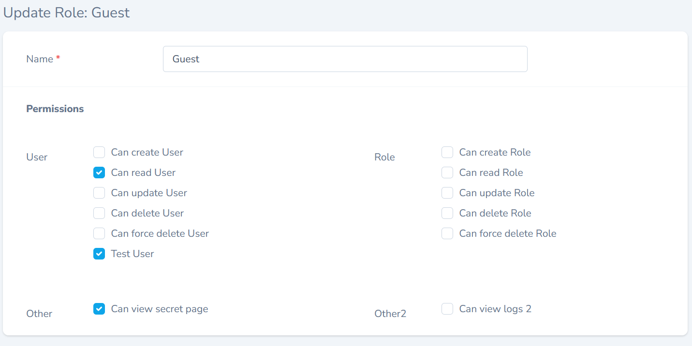
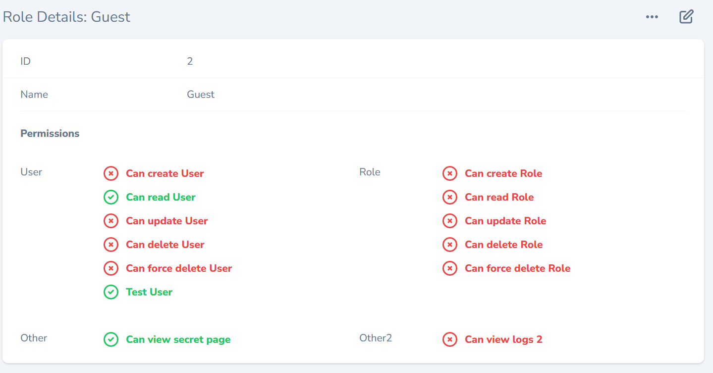
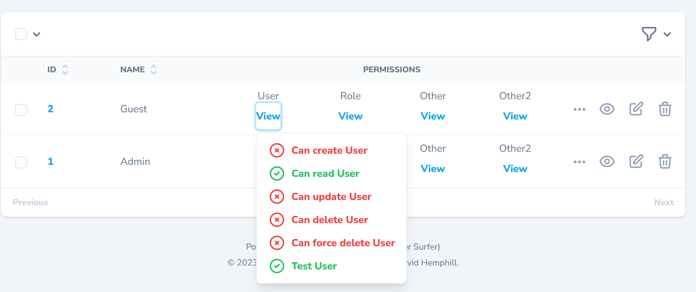

# PermissionGroup Field


## Prerequisites

1. Laravel Nova 4 installed in your application
2. Composer installed on your system

## Installation

```shell
composer require daliendev/permissiongroup
```

## Prepare your migrations

You will need a column in JSON format.
```php
class CreateRolesTable extends Migration
{
    /**
     * Run the migrations.
     *
     * @return void
     */
    public function up()
    {
        Schema::create('roles', function (Blueprint $table) {
            ...
            $table->json('permissions')->nullable();
            ...
        });
    }

    /**
     * Reverse the migrations.
     *
     * @return void
     */
    public function down()
    {
        Schema::dropIfExists('roles');
    }
}
```

## Basic Usage

To use the PermissionGroup field in your Nova application, you need to add the field to your Nova resource. To do this, simply add the following code:

```php
use Daliendev\PermissionGroup

public function fields(Request $request)
{
    return [
        ...
        PermissionGroup::make('Permissions', 'permissions')  
        ->on(User::class)  
        ->on(Role::class)  
        ...
    ];
}
```
This will display two CRUD oriented BooleanGroups and all the value will be stored in same {permissions} attribute/column of your model.

Custom permissions can also be specified (in addition to the CRUD on a resource and as an independent group):

```php
    PermissionGroup::make('Permissions', 'permissions')  
        ->on(User::class, [  
            'test' => 'Test'  
        ])  
        ->on(Role::class)  
        ->with('Other', [
            'can_view_secret_page' => 'can view secret page'
        ])  
        ->with('Other2', [  
            'can_view_logs' => 'can view logs'  
        ]),
```

So **permissions** column of your role can store as much value as needed in JSON format:
```json
["can_view_role", "can_view_user", "can_view_logs_other", "test_user"]
```

As all Laravel Nova Fields the following methods may be used to show / hide fields based on the display context:

```text
    showOnIndex
    showOnDetail
    showOnCreating
    showOnUpdating
    showOnPreview
    showWhenPeeking
    hideFromIndex
    hideFromDetail
    hideWhenCreating
    hideWhenUpdating
    onlyOnIndex
    onlyOnDetail
    onlyOnForms
    exceptOnForms
```

For more details please refer to related [Laravel Nova documentation page](https://nova.laravel.com/docs/4.0/resources/fields.html#showing-hiding-fields).

Some example screenshots:





--------

2023
